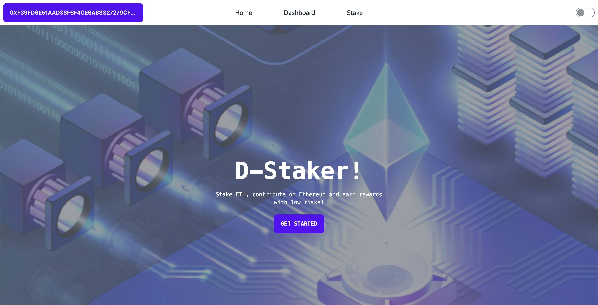

# D-Staker

A decentralized, permissionless staking service that allows anyone to stake any amount of ether, receive rewards and contribute to the ecosystem health without any restrictions.

## Home Screen


## Dashboard Screen


## Stake Screen


# Tracks
* Build a Staking Pool - SSV Network
* Build a DVT-based Staking Service
* Test locally with zero-config forking using Infura's free archive node access
* Integrate Tenderly Web3 Gateway
* Tenderly Simulation API Integration
* Use fRPC to connect your dApp to Blockchain
* Connect the world with Chainlink
* Chainlink Functions

# Tecnical details
## Create validator keys

```sh
./deposit.sh new-mnemonic --num_validators=<NUM_VALIDATORS> --mnemonic_language=english --chain=<CHAIN_NAME> --folder=<YOUR_FOLDER_PATH>
```

## Get operators from SSV Network
* https://api.ssv.network/api/v2/prater/operators - list all operators (paginated)
* https://api.ssv.network/api/v2/prater/operators/42/ - get an specific

## Register a new validator on the system
We will emit an event every time a 32 eth amount is reached on staking. A defender sentinel will be triggered and an api enpoint called where the validator keys will be generated, operators will be selected from ssv.network and the new validator registered on the system.

## How to run the tests
There're diffent ways to run tests
## Forge test using a goerli's fork
```sh
source .env.local && forge test --fork-url $INFURA_RPC_URL -vvv
```

## Local deployment using ganache
1 - Run ganache in one terminal
```sh
  source .env.local && ganache -f $INFURA_RPC_URL
```

2 - Deploy the contracts
```sh
  source .env.local && forge script ./script/Deploy.s.sol --rpc-url $GANACHE_RPC_URL --broadcast --private-key $GANACHE_PRIVATE_KEY
```

3 - Run the frontend
```sh
  cd frontend && yarn dev-frontend-local
```

## Local deployment using anvil
1 - Run anvil
```sh
  source .env.local && anvil --fork-url $INFURA_RPC_URL --chain-id 31337
```

2 - Deploy the contracts
```sh
  source .env.local && forge script ./script/Deploy.s.sol --rpc-url $RPC_URL --private-key $DEPLOYMENT_PRIVATE_KEY -vvv --broadcast
```

## Deploy on a testnet
1 - Deploy the contracts using tenderly gateway
```sh
source .env && forge script ./script/Deploy.s.sol --rpc-url $TENDERLY_GATEWAY --broadcast --private-key $PRIVATE_KEY --legacy
```

2 - Start the frontend
```sh
  yarn dev-frontend-remote
```

# Some usefull commands

## Run tests using a Goerli fork

```sh
source .env.local && forge test --fork-url $INFURA_RPC_URL
```

## Deploy on local node

### First terminal
```sh
source .env && anvil --fork-url $INFURA_RPC_URL --chain-id 31337
```

## Second Terminal
```sh
source .env && forge script ./script/Deploy.s.sol --rpc-url http://localhost:8545 --private-key 0xac0974bec39a17e36ba4a6b4d238ff944bacb478cbed5efcae784d7bf4f2ff80 --broadcast
```

## Deploy with tenderly gateway
```sh
source .env && forge script ./script/Deploy.s.sol --rpc-url https://goerli.gateway.tenderly.co/4qcCAJIkvm7jWdk51yzcu9 --broadcast --private-key $PRIVATE_KEY --legacy
```

## USE fRPC

1 - Clone https://github.com/fluencelabs/fRPC-Substrate
2 - Follow the guide

```sh
npm run run configs/quickstart_config.json
```

## Add Rewards
1 - On ganache (localy)
```sh
  source .env.local && forge script ./script/AddRewards.s.sol --rpc-url $GANACHE_RPC_URL --broadcast --private-key $GANACHE_PRIVATE_KEY
```

2 - Remotely
```sh
  source .env.local && forge script ./script/AddRewards.s.sol --rpc-url $RPC_URL --broadcast --private-key $PRIVATE_KEY
```

## Stake
1 - On ganache (localy)
```sh
  source .env.local && forge script ./script/Stake.s.sol --rpc-url $GANACHE_RPC_URL --broadcast --private-key $GANACHE_PRIVATE_KEY
```

2 - Remotely
```sh
  source .env.local && forge script ./script/Stake.s.sol --rpc-url $RPC_URL --broadcast --private-key $PRIVATE_KEY
```

## Unstake
1 - On ganache (localy)
```sh
  source .env.local && forge script ./script/Unstake.s.sol --rpc-url $GANACHE_RPC_URL --broadcast --private-key $GANACHE_PRIVATE_KEY
```

2 - Remotely
```sh
  source .env.local && forge script ./script/Unstake.s.sol --rpc-url $RPC_URL --broadcast --private-key $PRIVATE_KEY
```

## Add rewards on anvil
```sh
source .env.local && AMOUNT=30 SCA=0x0a08a41b691ec9954cc3170f9fb9ae819686ba00 forge script ./script/AddRewards.s.sol --rpc-url $ANVIL_RPC_URL --broadcast --private-key $ANVIL_PRIVATE_KEY -vvvv
```

## Add rewards on ganache
```sh
source .env.local && AMOUNT=30 SCA=0x0a08a41b691ec9954cc3170f9fb9ae819686ba00 forge script ./script/AddRewards.s.sol --rpc-url $GANACHE_RPC_URL --broadcast --private-key $GANACHE_PRIVATE_KEY -vvvv
```